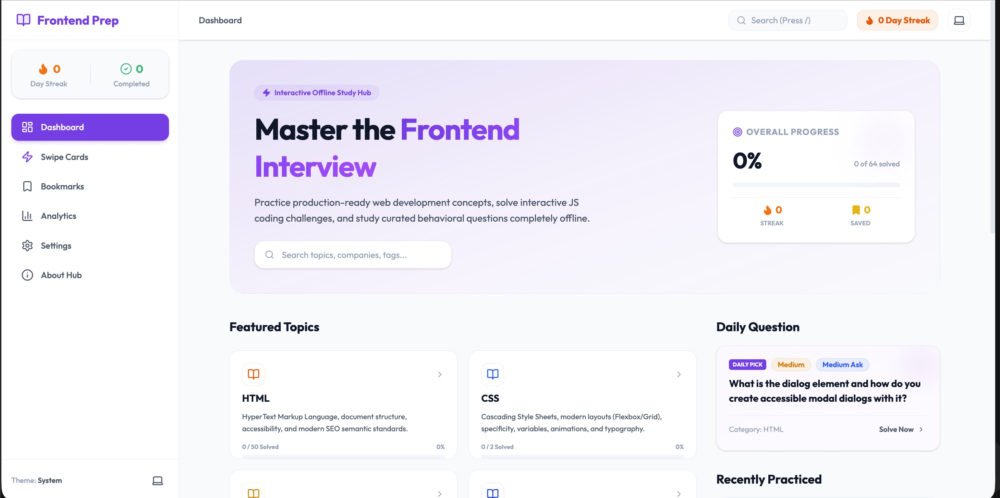
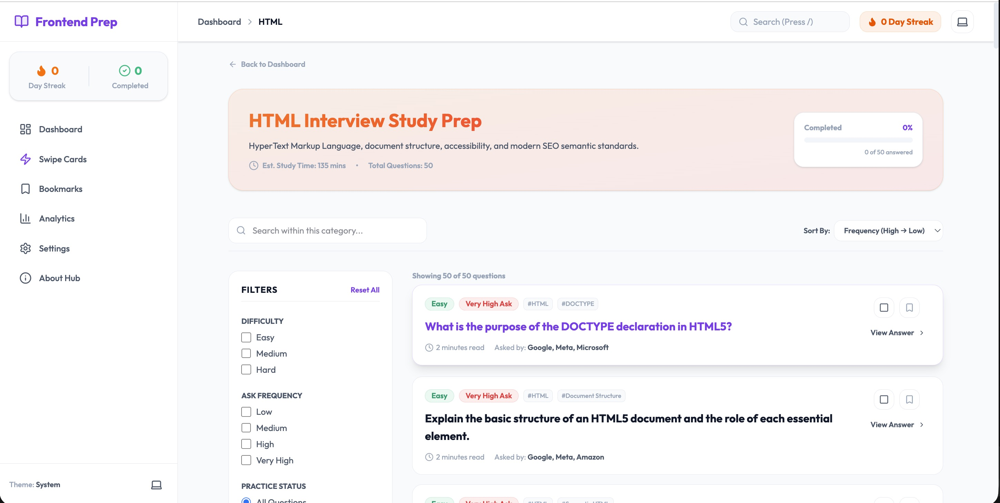
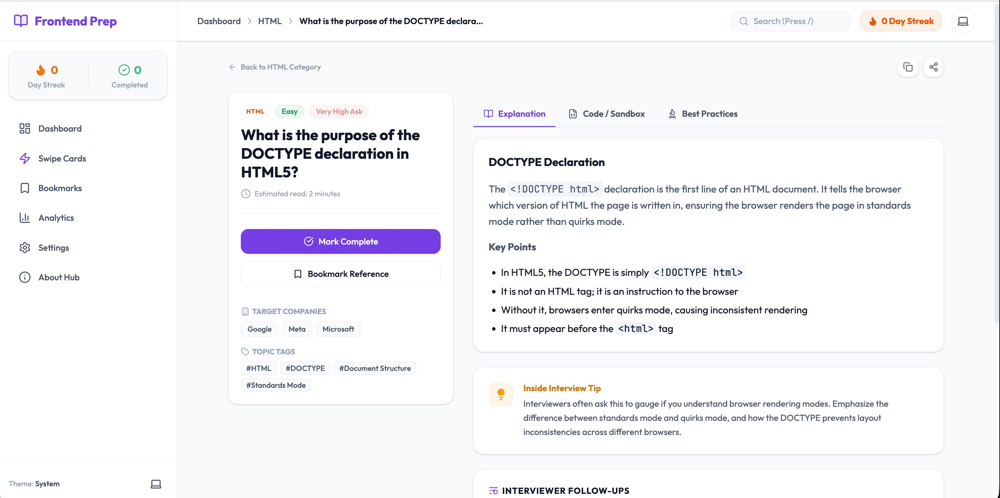

# Frontend Interview Preparation Web Application

A offline-capable, and mobile-friendly Frontend Interview Preparation Web Application built using React 19, Vite, TypeScript, Zustand, and Framer Motion.

**Live Demo:** [js-prep.netlify.app](https://js-prep.netlify.app/#/)

## Previews

### Dashboard & Analytics


### Category Browser


### Question & Answer View


## Tech Stack
* **Framework**: React 19 + Vite
* **State Management**: Zustand
* **Styling**: Tailwind CSS
* **Animations**: Framer Motion
* **Routing**: React Router
* **Search**: Fuse.js (Debounced client-side search)
* **Data**: Local JSON files (HTML, CSS, JS, Performance, etc.)

## Expanding the ESLint configuration

If you are developing a production application, we recommend updating the configuration to enable type-aware lint rules:

```js
export default defineConfig([
  globalIgnores(['dist']),
  {
    files: ['**/*.{ts,tsx}'],
    extends: [
      // Other configs...

      // Remove tseslint.configs.recommended and replace with this
      tseslint.configs.recommendedTypeChecked,
      // Alternatively, use this for stricter rules
      tseslint.configs.strictTypeChecked,
      // Optionally, add this for stylistic rules
      tseslint.configs.stylisticTypeChecked,

      // Other configs...
    ],
    languageOptions: {
      parserOptions: {
        project: ['./tsconfig.node.json', './tsconfig.app.json'],
        tsconfigRootDir: import.meta.dirname,
      },
      // other options...
    },
  },
])

```

You can also install [eslint-plugin-react-x](https://github.com/Rel1cx/eslint-react/tree/main/packages/plugins/eslint-plugin-react-x) and [eslint-plugin-react-dom](https://github.com/Rel1cx/eslint-react/tree/main/packages/plugins/eslint-plugin-react-dom) for React-specific lint rules:

```js
// eslint.config.js
import reactX from 'eslint-plugin-react-x'
import reactDom from 'eslint-plugin-react-dom'

export default defineConfig([
  globalIgnores(['dist']),
  {
    files: ['**/*.{ts,tsx}'],
    extends: [
      // Other configs...
      // Enable lint rules for React
      reactX.configs['recommended-typescript'],
      // Enable lint rules for React DOM
      reactDom.configs.recommended,
    ],
    languageOptions: {
      parserOptions: {
        project: ['./tsconfig.node.json', './tsconfig.app.json'],
        tsconfigRootDir: import.meta.dirname,
      },
      // other options...
    },
  },
])

```
## Netlify Deployment

This project is configured for deployment on Netlify using the `netlify.toml` configuration file.

### Deployment Options

#### Option 1: Deploy using Netlify CLI
1. Install Netlify CLI globally:
   ```bash
   npm install -g netlify-cli
   ```
2. Build the project locally:
   ```bash
   npm run build
   ```
3. Deploy:
   ```bash
   netlify deploy --prod
   ```

#### Option 2: Continuous Deployment (Git-integrated)
1. Push your repository to GitHub, GitLab, or Bitbucket.
2. Log in to [Netlify](https://www.netlify.com/).
3. Click **Add new site** > **Import an existing project**.
4. Select your Git provider and authorize Netlify.
5. Select the repository.
6. Netlify will automatically detect the configuration settings from `netlify.toml`:
   - **Build command**: `npm run build`
   - **Publish directory**: `dist`
7. Click **Deploy site**.
